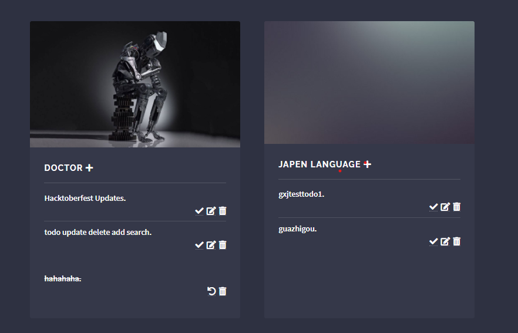

# django-Todolist
This a simple web practice using HTML5/CSS + Django python + Sqlite.

todos show as cards

Todos:
  1.  Add diary summary function for users
  2.  Category update delete add (√)
  3.  Add quotes for users(√)
  4.  data analysis by time

templates: desined by https://html5up.net/
