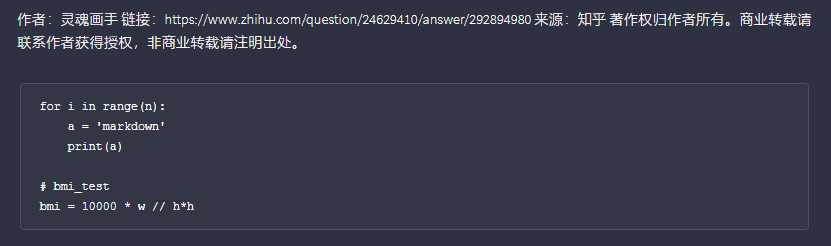
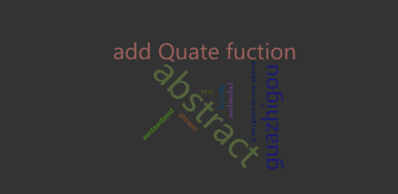

# django-Todolist
This a simple web practice using HTML5/CSS + Django python + Sqlite.

todos show as cards

wirte tec dinary 

support markdown 

weekly todo analysis

future:
  1. travel dinary and map visualization
  2. technique visualization
  3. Pagination 

templates: desined by https://html5up.net/  (html5/css)
very useful design website
